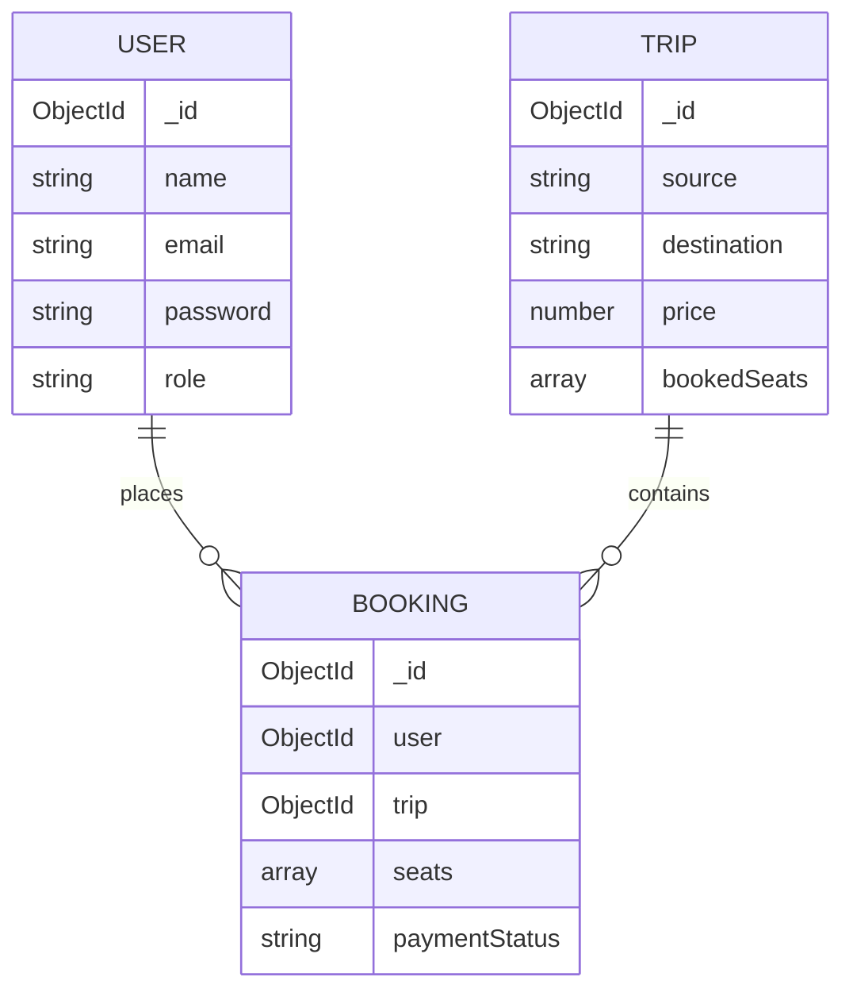

# Database Documentation

This section explains how data is structured and stored using MongoDB and Mongoose.

## 1. MongoDB Structure
MongoDB is a NoSQL database. Instead of tables and rows (like SQL), it uses **Collections** and **Documents**.
- A single user record is a JSON-like **Document**.
- All user documents are stored together in a **Collection** called `users`.

## 2. Mongoose Schemas & Models
Mongoose is an ODM (Object Data Modeling) library. MongoDB is naturally schema-less (you can put any data anywhere). Mongoose forces a strict structure on the data before it gets saved.

- **Schema:** The blueprint. It defines exactly what fields exist, what data type they are (String, Number, Date), and validation rules (e.g., `required: true`).
- **Model:** The compiled version of the Schema. Models are responsible for creating and reading documents from the underlying MongoDB database.

## 3. Relationships: References vs. Embedded Docs
In NoSQL, you have two ways to connect data:
1. **Embedded:** Putting a document inside another document (e.g., an array of seat objects inside a Trip). Good for data that is always accessed together.
2. **References:** Saving an ID that points to another document (e.g., a Booking saves the `userId` and `tripId`). Good for large, independent datasets. This app uses References heavily to connect Bookings to Users and Trips.

---

## 4. Collection Explanations

### A. The `User` Schema (`backend/models/User.js`)
Stores customer and admin profiles.

- `name` (String): The user's full name. Required.
- `email` (String): Used for login. Required and must be `unique` to prevent duplicate accounts.
- `password` (String): The hashed password. **Never store plain text passwords.**
- `role` (String): Either 'user' or 'admin'. Defaults to 'user'. This determines what parts of the app they can access.

**Connection:** Linked to `Booking` documents to track who made the reservation.

### B. The `Trip` Schema (`backend/models/Trip.js`)
Stores information about specific bus journeys.

- `busName` / `operator` (String): Who is running the bus.
- `source` / `destination` (String): Where the bus goes.
- `departureTime` / `arrivalTime` (Date/String): When it runs.
- `price` (Number): Cost per seat.
- `totalSeats` (Number): Usually 40 or 45.
- `bookedSeats` (Array of Strings/Numbers): **Crucial field**. If someone books seat "1A", "1A" gets added to this array. The frontend uses this array to make seats gray/unclickable.

**Connection:** Queried by the frontend to display search results. Linked to `Booking` documents.

### C. The `Booking` Schema (`backend/models/Booking.js`)
The "transaction" record connecting a User, a Trip, and Money.

- `user` (ObjectId): A reference pointing to the `User` who booked.
- `trip` (ObjectId): A reference pointing to the specific `Trip`.
- `seats` (Array of Strings): Which specific seats were booked (e.g., `['1A', '1B']`).
- `totalAmount` (Number): The final price paid.
- `paymentStatus` (String): Usually 'Pending', 'Completed', or 'Failed'.
- `bookingDate` (Date): When the transaction occurred.

**Connection:** Requires data from both User and Trip to exist. Fetched by the frontend for the `/my-bookings` page.

---

## 5. Database Relationship Diagram

