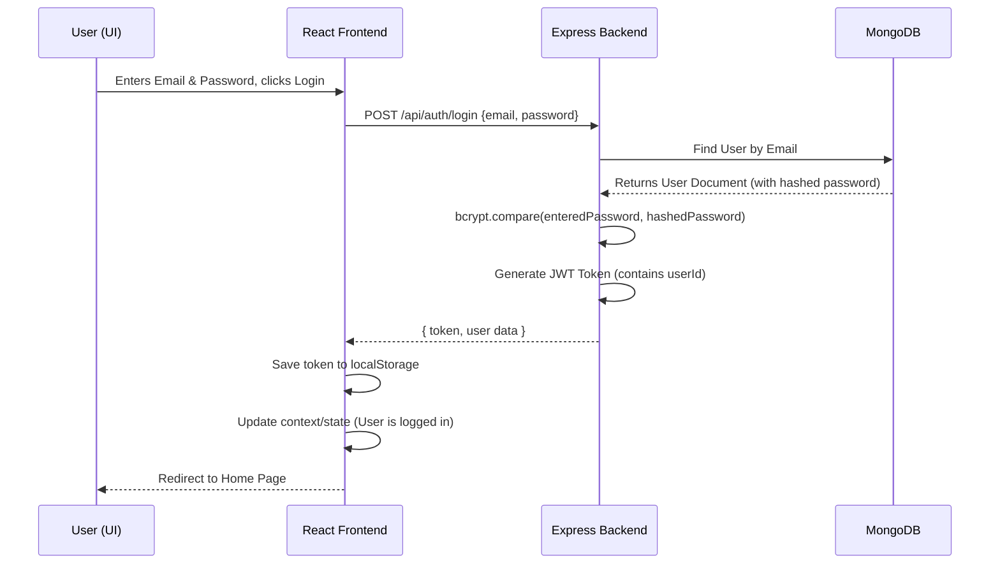
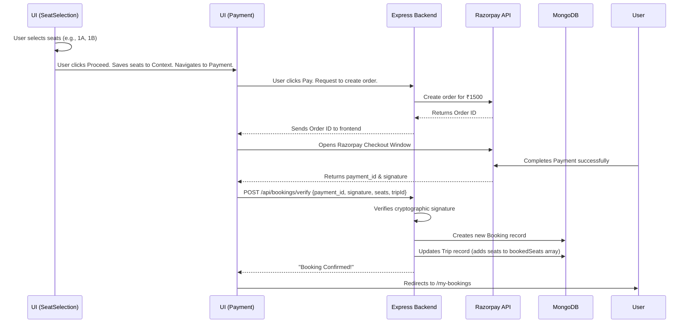

# Complete Application Flow

This section visualizes the step-by-step journeys a user takes through the application.

---

## 1. Authentication Flow (Login)

How does a user securely log into the app?

---

## 2. Trip Search Flow

How does the search bar actually find buses?

1. **Frontend Action:** User selects "Mumbai" to "Pune" and a date on the Home page, then clicks "Search".
2. **API Request:** React uses Axios to make a request: `GET /api/trips?source=Mumbai&destination=Pune&date=2026-05-20`
3. **Express Route:** The `tripRoutes.js` file catches this URL and routes it to the `searchTrips` controller.
4. **Controller & Database:** The controller builds a query object and asks MongoDB: `Trip.find({ source: "Mumbai", destination: "Pune" })`.
5. **Response:** MongoDB returns an array of matching trips. The backend sends this JSON array to the frontend.
6. **UI Update:** The `/trips` page receives the array, loops through it (`trips.map(...)`), and renders a `TripCard` component for every trip found.

---

## 3. End-to-End Booking & Payment Flow

This is the most critical and complex flow in the application.

---

## 4. Protected Route Flow (My Bookings)

How do we ensure only the logged-in user can see their bookings?

1. **Frontend:** User clicks "My Bookings".
2. **Frontend:** React retrieves the JWT token from `localStorage`.
3. **API Request:** React sends `GET /api/bookings/my-bookings` and includes the token in the headers: `Authorization: Bearer <token>`.
4. **Middleware:** The backend receives the request. Before hitting the controller, `authMiddleware.js` intercepts it.
5. **Validation:** The middleware checks if the token is valid and not expired. It decodes the token to find the `userId`.
6. **Controller:** The request is passed to the controller, which now knows exactly which user is asking (`req.user.id`).
7. **Database Query:** The controller asks MongoDB: `Booking.find({ user: req.user.id })`.
8. **Response:** Sends only that specific user's bookings back to the UI.
